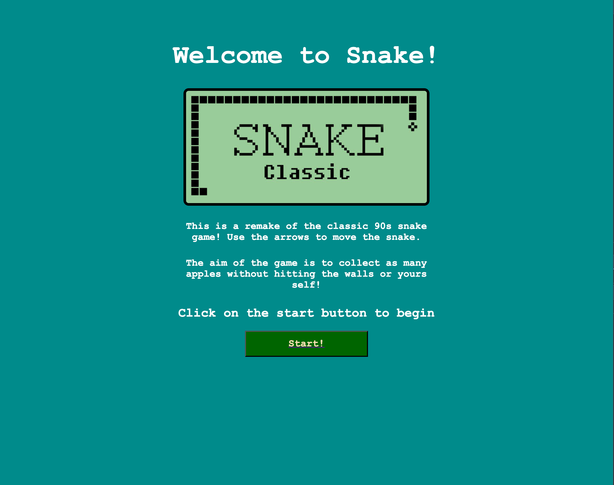
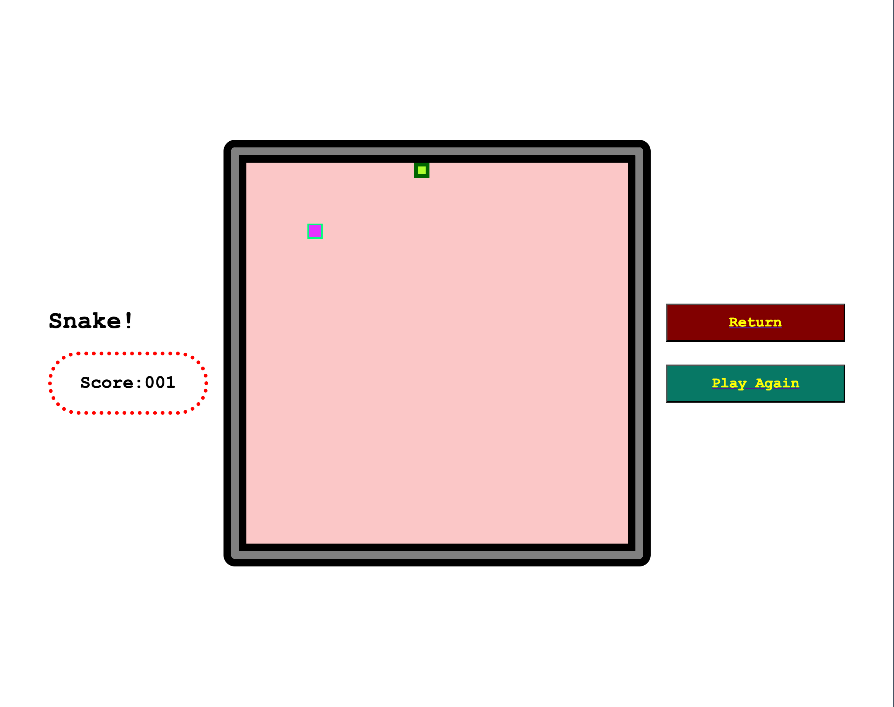

# ProjectOneSnakeGame

GA SEI Project 1 - Snake Game
Project Title

## Date: 30/04/2024

### By: Yusef Zaman

#### [GitHub](https://github.com/yusefzaman) | [LinkedIn](https://www.linkedin.com/in/yusefzaman/)

---

### **_Description_**

##### I will be developing a 'snake' game that will be similar to the classic arcade game that requires the user to navigate around a grid without the wall or hitting itself.

##### The user can increase its score by collecting apples that will be placed randomly around the grid. each time the user collects an apple, the length of the snake will increase by one unit.

##### The game will require the user to navigate using the arrow keys to move around the arena, the user can replay and try to beat their previous high score.

---

### **_Getting Started_**

#####

---

### **_Screenshots_**

##### GameStartPage

##### GamePlay

### **_Credits_**

---
